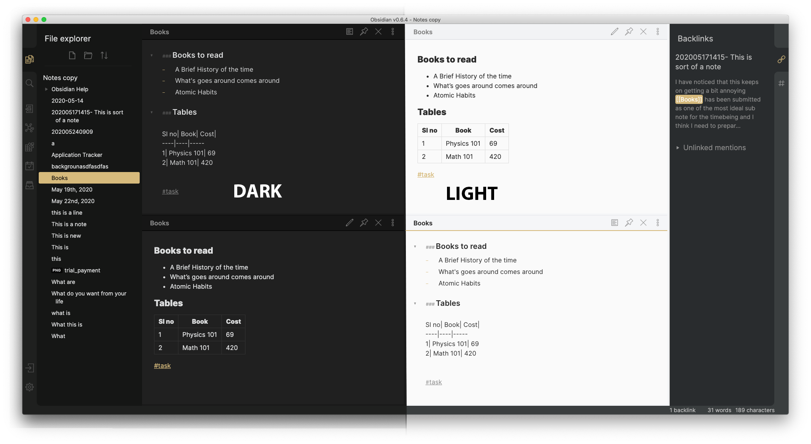
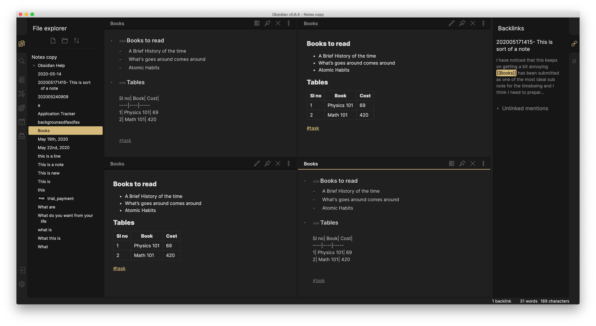
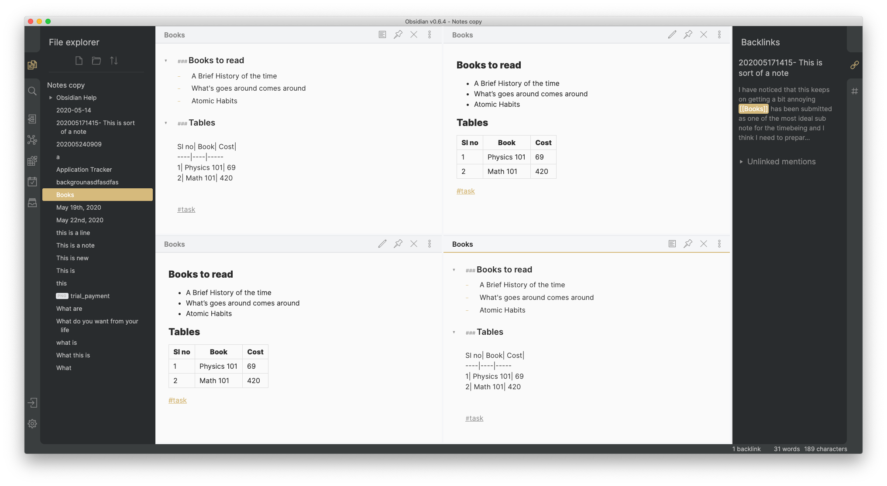

### Subtlegold

######  An obsidian theme

You can use this theme by enabling community theme from the the Obsidian plugin menu and clicking settings icon or by pasting the provided obsidian.css file from the repository in your Obsidian Vault.

> Subtlegold Theme

This is how it looks in the Dark theme mode

> Subtlegold Darkmode

This is how it looks in the Light theme mode

> Subtlegold Lightmode

